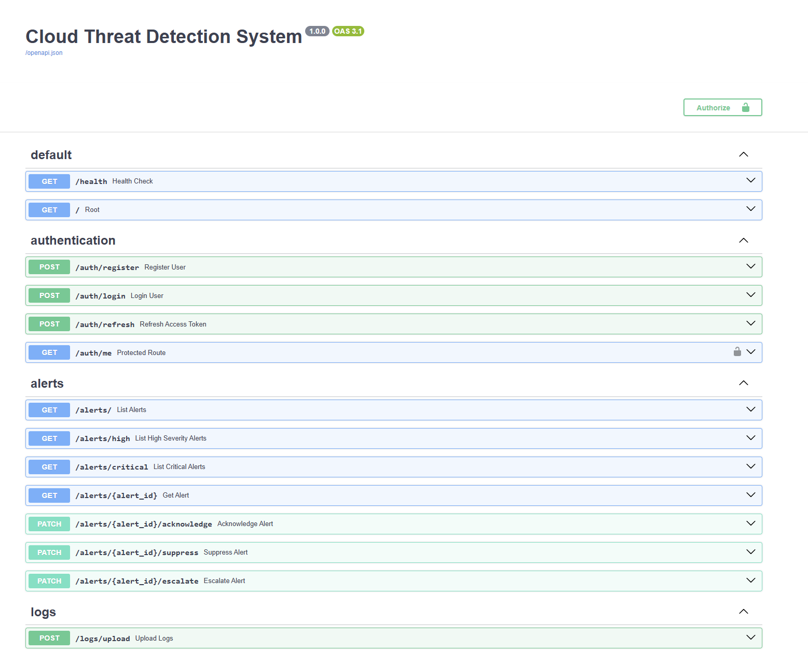
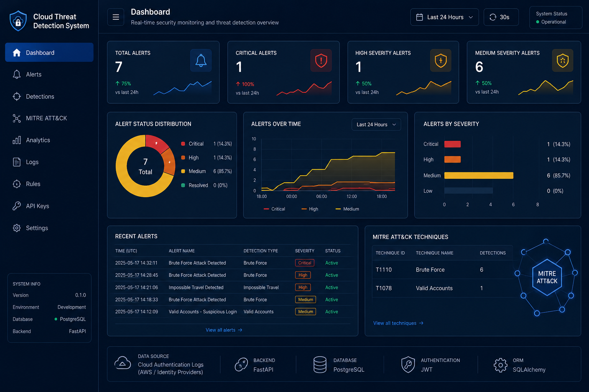
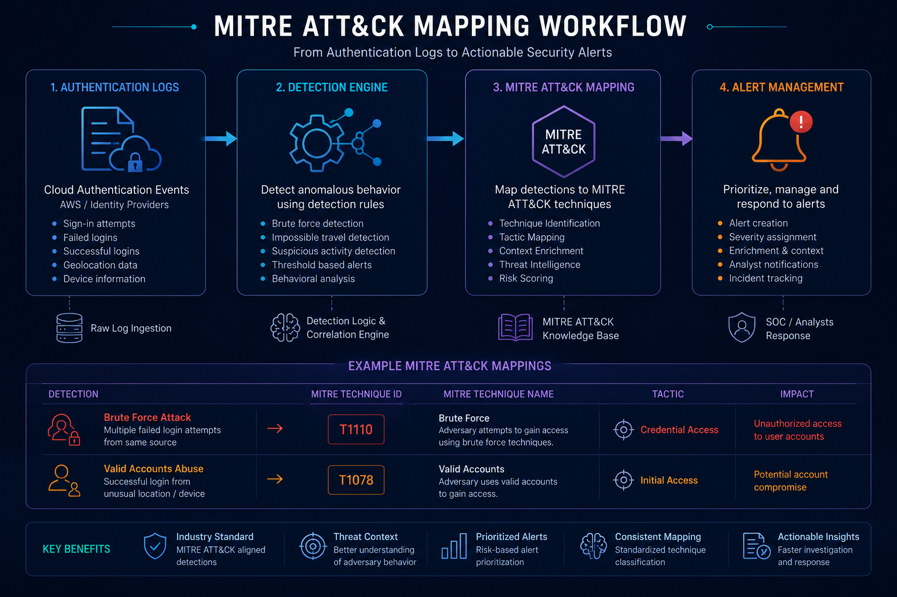

  

# Cloud Threat Detection System

## Project Overview

[Existing content]

## Key Features

[Existing content]

## Architecture

Short architecture explanation.

## Technology Stack

[Existing content]

## Detection Pipeline

[Existing content]

## Screenshots

### Swagger API Documentation

Interactive API documentation built with FastAPI and Swagger UI.

### Detection Results

Generated alerts enriched with MITRE ATT&CK mappings and risk scores.

### MITRE ATT&CK Mapping

Current ATT&CK technique mappings implemented in the platform.

## Detection Demonstrations

### Brute Force Detection

Detects repeated failed login attempts and generates T1110 alerts.

### Impossible Travel Detection

Detects logins from geographically distant locations within unrealistic timeframes and generates T1078 alerts.

## MITRE ATT&CK Mapping

| Detection | ATT&CK ID | Technique |
|------------|-----------|------------|
| Brute Force Login | T1110 | Brute Force |
| Impossible Travel | T1078 | Valid Accounts |

## Alert Lifecycle

OPEN
→ ACKNOWLEDGED
→ SUPPRESSED
→ ESCALATED

## API Documentation

See:

- docs/API_REFERENCE.md
- docs/ARCHITECTURE.md
- docs/DETECTION_ENGINE.md

## Local Development Setup

[Existing content]

## Example Alert Output

[Existing content]

## Future Roadmap

[Existing content]

## Wazuh Differentiation

This project is intentionally positioned as a lightweight API-first threat detection platform focused on detection engineering concepts, MITRE ATT&CK enrichment, alert triage workflows, and cloud security monitoring.

Unlike Wazuh, which is a full SIEM/XDR platform with agents, compliance modules, and enterprise-scale monitoring, this project focuses on demonstrating the core building blocks of a detection engineering platform.

## Documentation

See the docs directory for detailed documentation.

## Contributing

See docs/CONTRIBUTING.md

## License

MIT License

## Author

Hrishikesh Rayasa
M.Tech CSE (Networks)
Manipal Institute of Technology