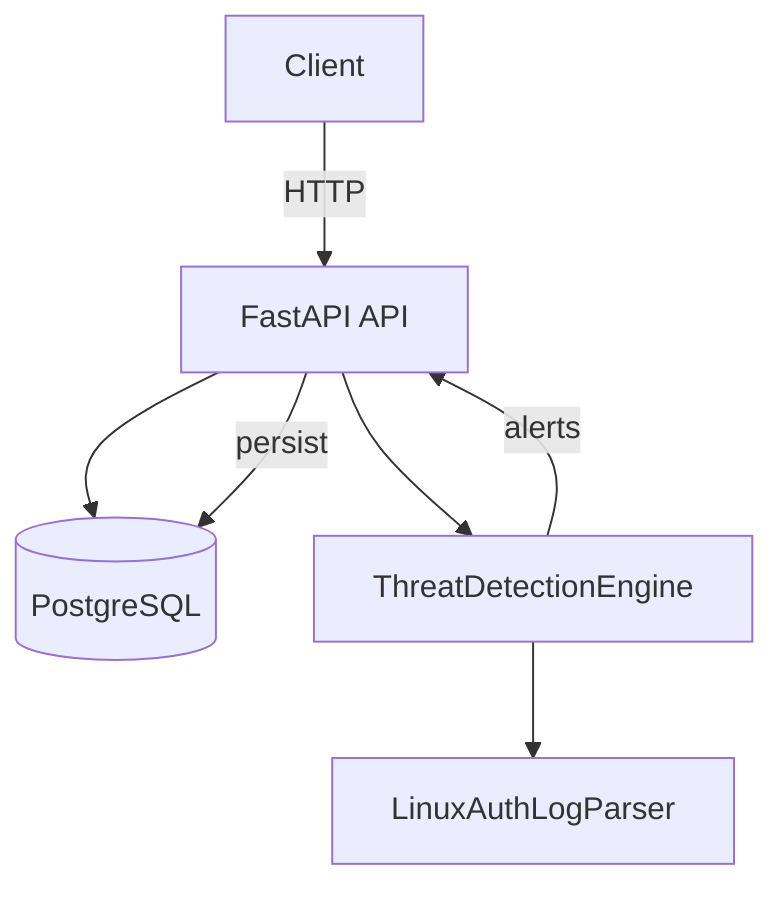
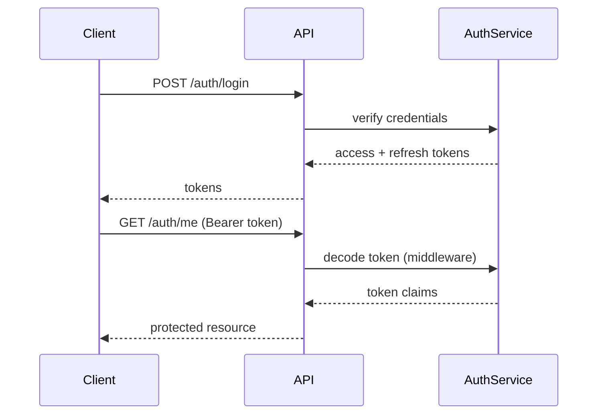

# Architecture

## High-Level Architecture

The service is intentionally simple and modular:

- API Layer: FastAPI application (`backend/app/main.py`, `backend/app/api/*`) exposing authentication, log ingestion, and alert management endpoints.
- Detection Engine: Rule-based engine (`backend/app/services/threat_detection.py`) that parses logs and evaluates detection rules.
- Persistence: PostgreSQL via SQLAlchemy models (`backend/app/models/*.py`) for `users` and `alerts` tables.
- Utilities: `LinuxAuthLogParser` (`backend/app/utils/log_parser.py`) provides secure regex parsing for auth logs.

**Mermaid: System Architecture**

## Component Responsibilities

- `app.api.auth` – user registration, login, refresh, and protected demo endpoint.
- `app.api.logs` – `POST /logs/upload` to accept batched logs and run detection.
- `app.api.alerts` – list alerts and triage endpoints to acknowledge/suppress/escalate.
- `app.services.threat_detection` – detection rules, risk scoring, MITRE enrichment.
- `app.utils.log_parser` – robust parsing for Linux auth logs (failed/accepted SSH, invalid user, sudo events).

## Authentication Flow

## Detection Flow

1. `POST /logs/upload` receives JSON payload of log records.
2. `ThreatDetectionEngine.evaluate_logs()` parses each line into `ParsedLogEvent`.
3. Each registered rule runs `evaluate()` and returns zero or more `ThreatAlert` objects.
4. Alerts are sorted, logged, enriched (MITRE mapping) and returned to client. Caller persists alerts via API implementation.

## Alert Generation Flow

- `ThreatAlert` dataclass carries structured details, severity, risk_score and metadata.
- API persists `Alert` SQLAlchemy model with `threat_type`, `severity`, `source_ip`, `log_message`, `risk_score`, `mitre_technique_id`, `mitre_technique_name`, `status`, and `created_at`.

## Database Design

- `users` table: `id`, `email`, `hashed_password`, `role`, `is_active`, `created_at`, `updated_at`.
- `alerts` table: `id`, `threat_type`, `severity`, `source_ip`, `log_message`, `risk_score`, `mitre_technique_id`, `mitre_technique_name`, `status`, `created_at`.

## Extensibility

- Rules implement the `DetectionRule` protocol; add new rules by creating a class with `evaluate(events, thresholds)` and include it in `ThreatDetectionEngine` rules list or register dynamically.
