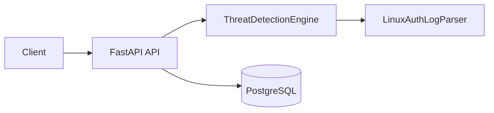
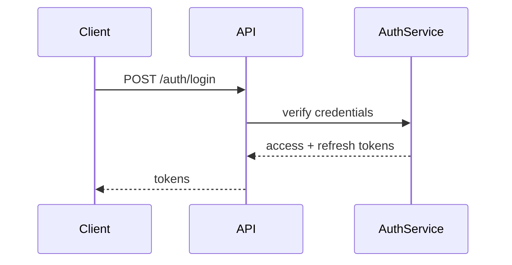
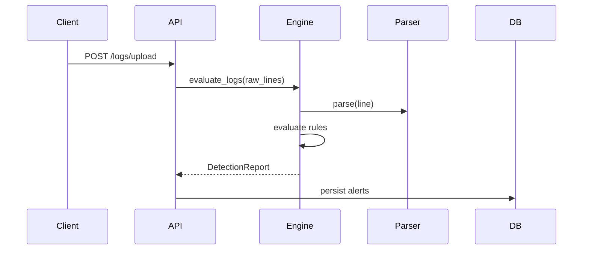
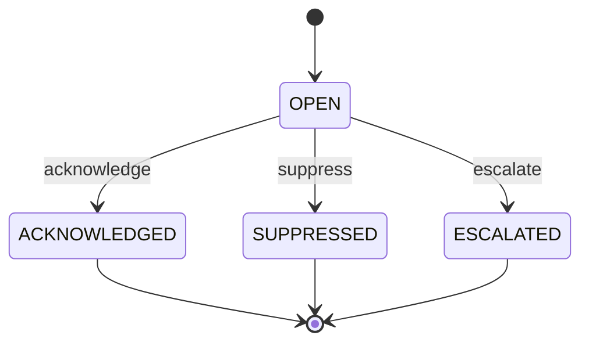
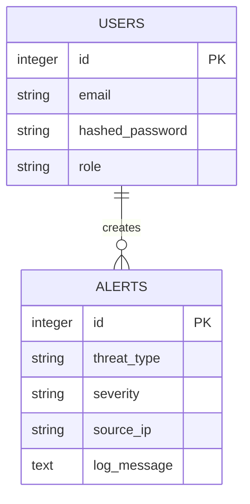

# Diagrams

This file holds mermaid diagrams describing the system architecture, authentication flow, detection flow, alert lifecycle, and database relationships.

## System Architecture

## Authentication Flow

## Detection Flow

## Alert Lifecycle

## Database Relationships

